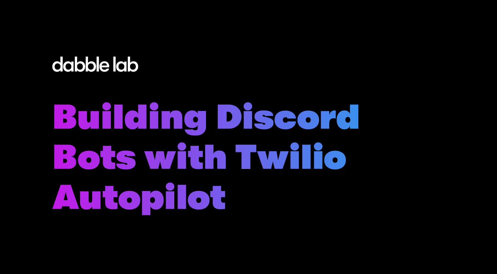

# Building Discord Bots with Twilio Autopiot

This repository contains the source code for the course [Building Discord Bots with Twilio Autopiot](https://learn.dabblelab.com/courses/building-discord-bots-with-twilio-autopilot). The course walks through creating a Discord bot that answers frequently asked questions using [Twilio Autopilot](https://twilio.com/autopilot). 

## Prerequisites

To follow along, you'll need at least a free account with the following services:

- [GitHub](https://github.com/signup)
- [Twilio](https://www.twilio.com/try-twilio?promo=0ziFtf)
- [Discord](https://discord.com/register)
- [Replit](https://replit.com/signup)

## Course Outline

The goal of this course is to create a Discord bot that lets users get answers to frequently asked questions from within a Discord server. Twilio Autopilot will provide the AI for answering the questions, and Replit.com will be used to host code for proxying requests between Discord and Autopilot. So, at a high level, there are five parts to this course.

1. Creating a Twilio Autopilot FAQ bot
2. Creating a Discord server
3. Creating a Discord bot application 
4. Authorization bot accesss to the Discord server
5. Creating a bot handler service

### Creating a Twilio Autopilot FAQ bot
- Login at [twilio.com](https://twilio.com)
- [Create a new bot](https://www.twilio.com/console/autopilot/build) from the FAQs pre-trained template
- Create tasks to handel questions
- Test the bot using the autopilot simulator
- Note the `ACCOUNT SID`, `AUTH TOKEN`, and `ASSISTANT SID`

### Creating a Discord server
- Login at [discord.com](https://discord.com)
- Create a new Discord server

### Creating a Discord bot application 
- Login at [discord.com](https://discord.com)
- [Create a new discord application](https://discord.com/developers/applications)
- Create a Discord bot user
- Setup OAuth2 
- Note the Discord bot `TOKEN`

### Authorization bot accesss to the Discord server
- Copy the Discord OAuth2 authorization URL
- Authorize access to the Discord server

### Creating a bot handler service
- Login to [replit.com](https://replit.com)
- Visit the [GitHub repo with the handler code](https://github.com/dabblelab/building-discord-bots-with-twilio-autopilot)
- Click the run on replit button to copy the code to replit.com
- Setup the following secrets/environment variable in Replit
    - `TWILIO_ACCOUNT_SID`
    - `TWILIO_AUTH_TOKEN`
    - `TWILIO_BOT_SID`
    - `DISCORD_BOT_TOKEN`
- Run the bot handler service

## Testing the Discord bot

To test the Discord bot access the Discird server and ask a question in the following format.

`!support {question}` - for example, `!support Can i move my service?`

You should see a response from the bot.

Done!